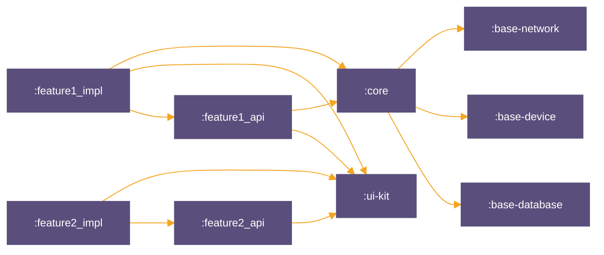
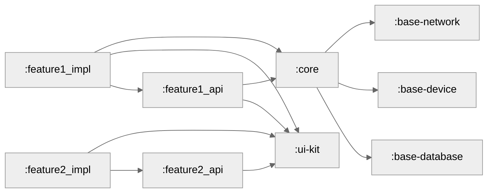

### Module Graph

```mermaid
%%{
  init: {
    'theme': 'base',
    'themeVariables': {"primaryTextColor":"#fff","primaryColor":"#5a4f7c","primaryBorderColor":"#5a4f7c","lineColor":"#f5a623","tertiaryColor":"#40375c","fontSize":"12px"}
  }
}%%

graph LR
  :feature1_impl --> :core
  :feature1_impl --> :ui-kit
  :feature1_impl --> :feature1_api
  :feature2_impl --> :ui-kit
  :feature2_impl --> :feature2_api
  :feature2_api --> :ui-kit
  :core --> :base-network
  :core --> :base-device
  :core --> :base-database
  :feature1_api --> :core
  :feature1_api --> :ui-kit
```
# Module Graph

```mermaid
%%{
  init: {
    'theme': 'neutral'
  }
}%%

graph LR
  :feature1_impl --> :core
  :feature1_impl --> :ui-kit
  :feature1_impl --> :feature1_api
  :feature2_impl --> :ui-kit
  :feature2_impl --> :feature2_api
  :feature2_api --> :ui-kit
  :core --> :base-network
  :core --> :base-device
  :core --> :base-database
  :feature1_api --> :core
  :feature1_api --> :ui-kit
```