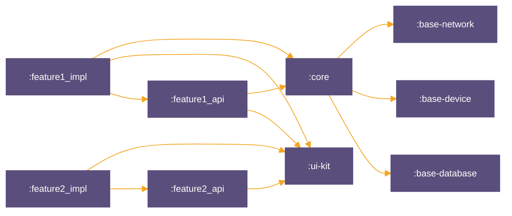

## Impact-Analysis-Tool

Данный sample предназначен, чтобы продемонстрировать возмжности инструмента анализа зависимостей
между модулями.
Инструмент позволяет выборочно запускать проверки на PR (напр. detekt или unit тесты) только для тех
модулей, которые были затронуты изменениями в PR.

### Demo

Вы можете создать новый файл под git-index через Android Studio или выполнить команды
```
echo "Hello Impact" >> ./modules/common/base-database/NewFile.kt
git add --all
```

После чего запустить выполнение тестов и detekt при помощи
```
./.tools/optimized-checks -d -t
```

Таск должен завершиться с ошибкой при выполнении теста

```
Feature1ImplTest > broken test FAILED
    java.lang.AssertionError at Feature1ImplTest.kt:11
```

Дальше смотрим логи и видим, что

1. В changes list detekt попал только один файл

```
changes_list=modules/common/base-database/NewFile.kt
Generating Detekt baseline...
Generation baseline duration: 0 seconds
Baseline was generated
No detekt violations indicated
Optimized detekt duration: 1 seconds
```

2. Для тестов impact-анализ определил как изменившиеся 4 файла

```
Impact Analysis.
Changed 1 modules: [base-database].
Affected 1 modules: [core].
Transitively Affected 2 modules: [feature1_api, feature1_impl]
```

Что соответствует графу модулей ниже

### Граф модулей



Заводомо сломанный тест, как раз находится в модуле feature1_impl. Таким образом вы можете
поэкспериментировать с изменениями в разных модулях и убедиться, что инструмент анализа зависимостей
работает корректно.
